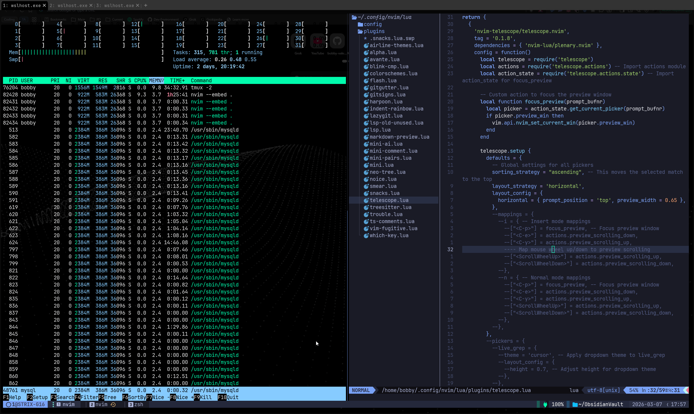
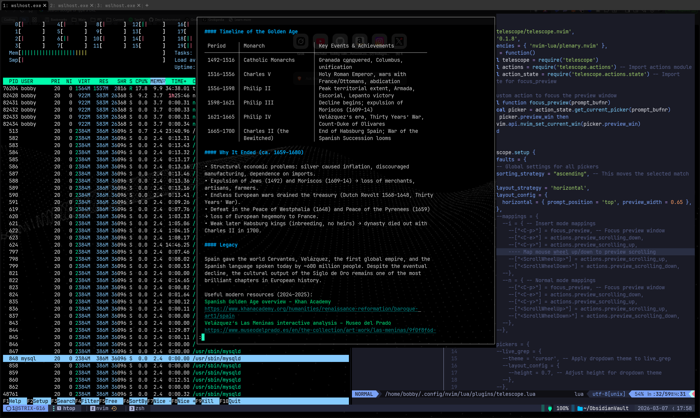
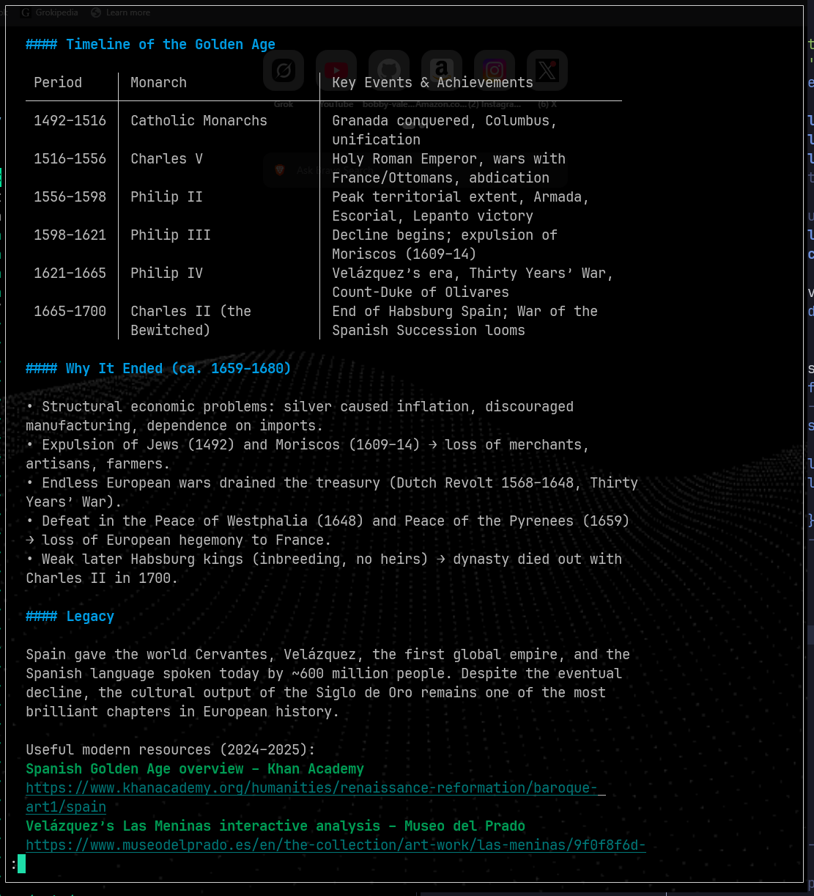
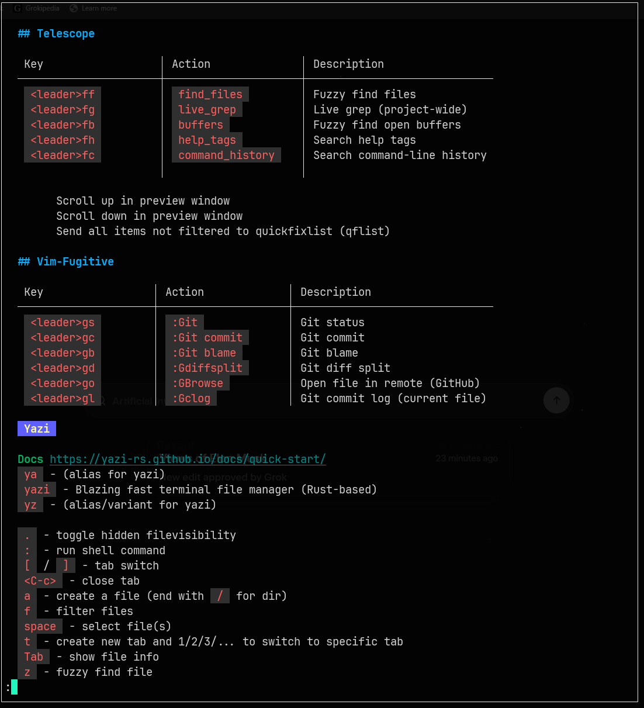

# tmux-markdown-heading-viewer
A tmux plugin that allows you to interactively select a Markdown heading from a file and display the markdown content starting from that section in your terminal using `glow` without having to leave your tmux pane (or god forbid your terminal entirely).

Great for quick access to your obsidian vault.

  

<br />

## Features

- **Interactive Selection**: Use fuzzy search to select folders, markdown files, and headings with `fzf`.
- **Markdown Rendering**: Display selected sections with syntax highlighting using `glow`.
- **Persistent Folders**: Remember the last selected folder for quick access.
- **Keybinds**:
  - `<prefix>+m`: Use the previously selected folder to choose a file and heading.
  - `<prefix>+M`: Select a new folder, then choose a file and heading.
- **Performance**: Optional support for `fd` and `tree` for faster directory and file searching.

## Requirements

- [`tmux`](https://github.com/tmux/tmux)
- [`fzf`](https://github.com/junegunn/fzf)
- [`bash`](https://www.gnu.org/software/bash/)
- [`glow`](https://github.com/charmbracelet/glow)

Optional to have (improved setup)
- [`fd`](https://github.com/sharkdp/fd)
- [`tree`](https://github.com/Old-Man-Programmer/tree)

## Installation

### Install using TPM

Put this in your configuration file,

```sh
set -g @plugin 'bobby-valenzuela/tmux-markdown-heading-viewer'
```

### Install manually using git

1. Clone the repository

```sh
git clone https://github.com/kenos1/tmux-markdown-heading-viewer ~/clone/path
```

2. Put this line in your config

```sh
run-shell ~/clone/path/tmux-markdown-heading-viewer.tmux
```

3. Restart `tmux`

## Usage

The plugin provides two keybinds for interacting with your markdown files:

- `<prefix>+m`: Use the previously selected folder to choose a markdown file and heading.
- `<prefix>+M`: Select a new folder (starting from `/home/`), then choose a markdown file and heading.

Both keybinds open a tmux popup where you can fuzzy search through folders, files, and headings using `fzf`.

## Configuration

Change the pager by changing your `PAGER` environment variable. This means adding this to your shell config:

```sh
export PAGER="less"
```


<br />

## Other images

  
  
  

